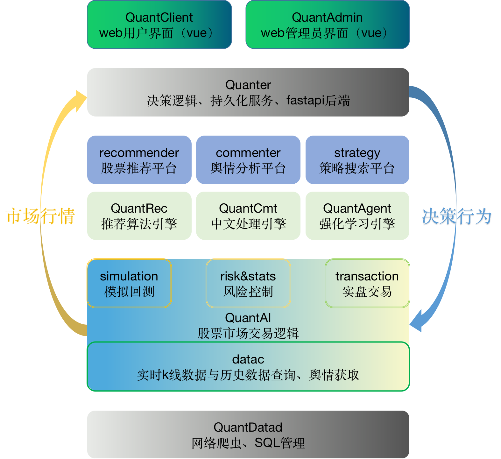

# QuantAI项目介绍

`QuantAI`项目由`QuantAILab`开发维护。主要目的在于使用最先进的人工智能方法，实现量化交易。

## 项目整体框架

- QuantClient: 基于vue编写的web前端页面。该模块作为独立项目开发，主要提供数据渲染和友好的可视化服务。
- Quanter：运行量化系统的核心项目。这个项目基于fastapi为QuantClient提供响应，同时提供一个后端管理界面，来快速的查看当前系统的状态，包括用户基本信息等。同时，该模块是运行策略，产生决策的核心。作为独立项目开发。
- recommender,commenter,strategy平台：这些平台依托底层的算法引擎，提供了大量预训练好的算法模型，并且提供了训练新的算法的环境。这些平台以独立项目开发的同时，将会提供QuantAI的API，使得相应的算法可以在QuantAI中直接调用。
- QuantRec,QuantCmt,QuantAgent引擎：这些算法引擎是支撑起整个QuantAI中智能量化服务的关键。
- QuantAI：抽象了整个股票、期货等的交易环境，并且提供了灵活的扩展。
- QuantDatad：网络爬虫、数据持久化、增量管理等。
